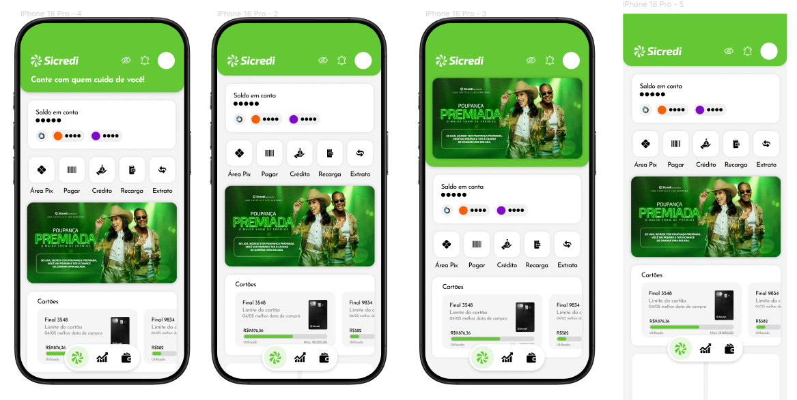

**Diclaimer** 
This project is an independent, unofficial redesign of Sicredi/Sicredi X, a Brazilian baking app. All trademarks, logos, and brand names belong to their respective owners. This redesign is for educational and portfolio purposes only and does not claim any ownership or affiliation with the original company. If there are any concerns regarding this project, please contact me, and I will address them promptly.

# Sicredi App Redesign
This redesign aims to modernize the current Sicredi/Sicredi X app, as the existing version contrasts with the image the company seeks to project through its marketing campaigns and architectural styles.

While the marketing and architectural departments are adopting a more modern, dynamic, vibrant, and streamlined approach, the application appears outdated, with its forms, colors, and layout reminiscent of an earlier era of the web.

**Link to the full redesign:**
https://www.figma.com/design/eLhzJ09pnAwZ1nUBkUgtkg/Sicredi-App-Redesign?node-id=0-1&t=ieRauPpy90fK86V4-1